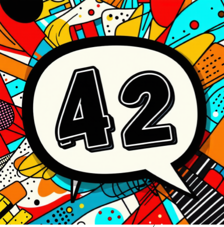

# 42 Ask Me Anything (42 AMA)

## Project overview
The "42 A.M.A" project is an initiative aimed at enhancing the quality of life for students at 42 by providing a more convenient communication channel that aligns with the peer-to-peer learning model. It is especially designed for those who may feel hesitant to ask or teach others within the campus environment.

This system will be integrated into the 42 website, making it easily accessible for students. The core feature of the system is matching students who need help with their current projects with those who are willing to offer advice based on projects they've completed.

Students who are open to providing guidance can set their status to A.M.A (Ask Me Anything) during their available times, similar to opening a slot for evaluations. Meanwhile, those seeking assistance can browse through available mentors and view their time slots for when they're open to questions.

# Presentation
[google slide](https://docs.google.com/presentation/d/1Mb3eUoSsoAbJTkOcNogm4T_wnY2S1Dgfd5KQSEEYV3c/edit#slide=id.g1e884407abe_0_183)

# Key feature
- Allow user to enable/disble A.M.A status
- list who enable/disble A.M.A status

# techstack
- FIGMA - for design

# Team member
[bhowe](https://profile.intra.42.fr/users/bhowe)  
[brybenja](https://profile.intra.42.fr/users/brybenja)  
[nwattana](https://profile.intra.42.fr/users/nwattana)  
[seokjyoo](https://profile.intra.42.fr/users/seokjyoo)  

# Demo

https://youtu.be/uhmJ9erFU8E